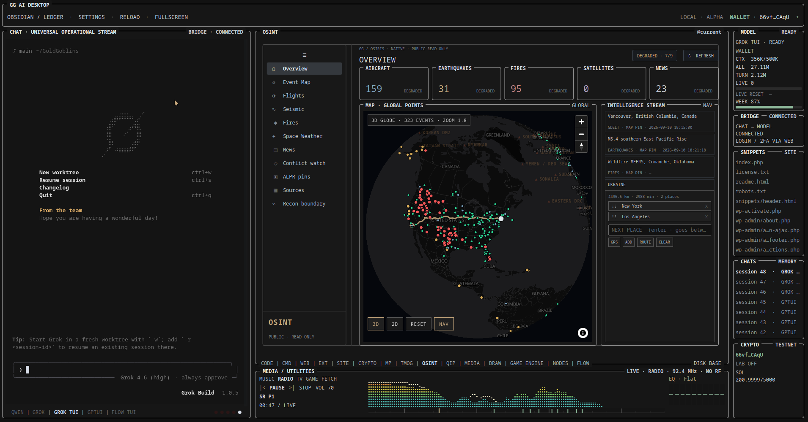

# GG AI Desktop



Public repo: [github.com/GoldGoblins/GG](https://github.com/GoldGoblins/GG)

This directory **is** the program. GROK TUI and GPTUI are two motors in the
same workspace. They use the same files, shared session catalog and laser-
Merkle knowledge tree; switching the motor does not switch the workspace.
Local Qwen GGUF files are not in git and are not required for GROK TUI.

```text
git clone https://github.com/GoldGoblins/GG.git
cd GG
chmod +x run-gg-ai-desktop.sh
./run-gg-ai-desktop.sh
```

Needs: Python 3, PySide6 + Qt WebEngine, Grok Build CLI, `grok login`.
Update: `git pull`. Push new features from this tree after they land here.

## Patch notes · 2026-09-09 · OSINT globe, shared chrome fonts, one live map

What GitHub had until this push: TMoG dashboard parity, first-try native TUI
input, GPTUI scrollback/copy, and the current desktop screenshot. This patch
does not replace that screenshot.

**OSINT is a real dark globe.** Overview and Event Map share one MapLibre
WebGL globe (the same engine family as [OSIRIS](https://osirisai.live/)). A
bundled Natural Earth land layer is always present so continents stay
visible even offline. When the network is up, OpenFreeMap dark tiles cover
that land with country names, coastlines and a cartographic globe instead of
a grey placeholder sphere. The dark local land paints first so the previous
blue style no longer sits behind a second copy.

**Public-read-only feeds.** OpenSky aircraft, USGS earthquakes, NASA EONET
fires, GDELT geolocated headlines, a reference conflict watchlist, and a
bundled sample of OSM/DeFlock ALPR *location pins* (not live video). The
intelligence stream is liveuamap-style: click a row to fly the globe and
open a detail pane. Aircraft heading ticks only appear after zoom 4.

**NAV lives in the stream pane, not on the map.** FROM / stops / TO as the
same chip style, drag-and-drop reorder, Enter/ROUTE, and waypoint dots on
the globe. Routing is Nominatim + OSRM through the host allowlist. GPS/Wi‑Fi
location can be used as FROM.

**Desktop chrome is monospace; the map keeps its own labels.** GG AI Desktop
UI text uses a monospace stack across tabs. OpenStreetMap place names on the
globe keep the map style's own font. The desktop still does not open camera
streams, scan IPs, or accept user-supplied targets. No credentials, session
state or model weights are added to git.

## Patch notes · 2026-09-09 · separate GAME ENGINE playground

The workspace now has a `GAME ENGINE` tab directly after `DRAW`. It is a
separate surface from `MEDIA → GAME`, which remains the lightweight
media/emulator player. The first engine slice is a local, asset-light
playground built around a fixed 60 Hz simulation, bounded data-oriented
entity and particle pools, a spatial-grid broadphase, chunk interest data,
live performance inspection, pooled debris bursts and deterministic input
record/replay.

The scene uses QtQuick3D primitives so it can be exercised immediately on
the existing desktop without adding a native compiler or shipping proprietary
game assets. A visible local-loopback network seam documents the future MMO
boundary, but no sockets, server, account access or live multiplayer are
enabled. The architecture takes inspiration from the requested fast,
gameplay-first engines while remaining original code; no source code or
assets from those projects are bundled.

## Patch notes · 2026-09-08 · bounded crypto research + QIP/WASM lab

Crypto now has a `FACTORY` page for bounded, paper-only strategy research.
It evaluates a small catalogue of transparent candidates with explicit fees
and slippage, no-lookahead signals, train/validation/test splits and visible
PASS/WATCH/REJECT evidence. The research board exposes separate researcher,
data-validator, implementer, reviewer and risk lanes, but keeps model-agent
spawning disabled and does not connect to an order path.

The implementation takes the useful workflow ideas from
[ECC](https://github.com/affaan-m/ECC)—plan, test, review, verify and retain
evidence—without installing its alpha harness into the desktop. Hype claims
from public crypto posts are not treated as trading evidence.

The workspace also has a `QIP` tab between `OSINT` and `MEDIA`. It is a local
QIP/WASM component lab inspired by
[qip.dev](https://qip.dev/), its
[component debugger](https://qip.dev/component-debugger) and
[royalicing/qip](https://github.com/royalicing/qip): import-free modules only,
bounded memory/table/module sizes, explicit UTF-8 input, deterministic output
checking and no network or host I/O. The first slice supports a narrow
`render` ABI through the installed Node runtime; the QIP instruction-stepper
is deliberately left as a later, separately bounded slice.

## Patch notes · 2026-09-08 · read-only Polymarket research

Crypto now has a `POLY` page for bounded market research against one selected
UTC hour in Pendulumflow's V3 Parquet archive. `SUMMARY`, `TRADES` and
`TOUCH` use fixed, visible DuckDB queries; the selected archive URL and SQL
preview remain visible for auditability.

The page is intentionally separate from the Solana wallet and all trading
paths. It does not place orders, request credentials or start `poly_data`
sync. DuckDB is optional; without it the desktop still starts and shows the
validated query preview. The public `poly_data` repository is documented as
an optional future ingestion source rather than vendored into the app.

## Patch notes · 2026-09-08 · native OSIRIS / OSINT surface

The desktop now includes an `OSINT` tab between `TMOG` and `MEDIA`, based on
the public, MIT-licensed [simplifaisoul/osiris project](https://github.com/simplifaisoul/osiris).
It keeps the OSIRIS idea and information architecture while rendering it as a
native Obsidian/Ledger surface instead of embedding a second Next.js app.

**Live public feeds.** The native panel can collect bounded, read-only data
from USGS earthquakes, OpenSky aircraft, NASA EONET events, CelesTrak station
objects, NOAA space weather and BBC World news. Every source has an explicit
health row, response limits and a visible status; network work runs away from
the Qt GUI thread and only starts when the OSINT surface is opened.

**OSIRIS-style views.** Overview, Event Map, Flights, Seismic, Fires, Space
Weather, News, Conflict watch, Sources and Recon boundary are available from
the new sidebar. The map uses the same dark dashboard language as TMoG and
shows bounded data points, while the reference conflict layer is clearly
labelled as a watchlist rather than live verified intelligence.

**Safe native boundary.** The integration intentionally does not expose port
scans, IP sweeps, arbitrary target probing or credential access. The Recon
page explains that boundary and the source panel makes public references
copyable without accepting a user-supplied URL or target.

## Patch notes · 2026-09-08 · TMoG parity, native input and approval stability

What GitHub had until this push: GPTUI scrollback, copy, the existing
task-scoped approval flow and the first functional TMoG surface.

What this patch adds:

**First-try native input.** GPTUI and GROK TUI keep keyboard focus after PTY
output and after a submitted line, so the next message does not need a second
attempt.

**Approval answers stay in the right lane.** A bare `ja`/`nej` is routed to
the task-scoped approval handler only when a matching approval is actually
waiting. Otherwise it remains ordinary conversation. When a waiting approval
is intercepted, the native line is cleared with the terminal line-kill
control rather than Ctrl-C, so the TUI prompt remains usable.

**Coverage.** Regression coverage now exercises native host ingress, focus
handoff, visible approval feedback and first-try `ja`/`nej` handling. The
desktop flow was also verified through the visible pointer and keyboard path.

**TMoG is a real dashboard surface.** Summary, Performance, Processes, System
Info, Startup apps, Users, Services, Power & Freq, Flight Recorder,
Connections, Installed Apps, Drivers, Disk Space and Benchmarks now have the
same live rows, meters, sorting and history-oriented structure as the actual
TMOG view, presented in the GG Obsidian/Ledger visual language.

**Full TMOG is safe to open.** `OPEN FULL TMOG` launches the real TMOG window
as an independent process instead of trying to reparent a native window into
Qt. That keeps the desktop alive when the button is pressed. Reload hydration
also completes without leaving the visible hydration state stuck.

**Screenshot.** `docs/gg-ai-desktop.png` is updated from the current desktop
capture, including GPTUI and the expanded TMOG dashboard. No credentials,
session state or model weights are added to git.

## Patch notes · 2026-09-06 · GPTUI scrollback, copy and approval flow

Previous public patch (`5edae4f`, documenting published source `aefff5b`)
already made GPTUI a first-class motor beside GROK TUI. This patch keeps that
architecture and finishes the parts that were still rough in daily use.

**Real GPTUI scrollback.** GPTUI now keeps bounded, row-based terminal
scrollback from the VT layer, including Codex's top-anchored inline scroll
regions. Older text is shown inside the fixed chat frame; the frame itself
does not move, empty screen snapshots are never used as history, and wheel
events cannot leak into the live prompt. The scrollbar is clamped to the real
viewport and follows the normal direction: top is older text, bottom is the
live tail.

**Normal terminal copy.** Drag selection is copied with Ctrl+C. Right-clicking
a selection opens the standard Copy context menu. Ctrl+C without a selection
keeps its normal terminal meaning and sends the interrupt character to the
PTY; Ctrl+Shift+C remains harmless when there is no selection. Grok TUI's
alternate-screen mouse handling remains unchanged.

**Universal Operational Stream remains authoritative.** Direct user messages
in the shared chat stream are the active task instruction, while
`AGENTS.md`, approval contracts and explicit red/yellow boundaries remain
the agent's guardrails. An operation approval is requested in the stream and
applies only to the current operation. A concrete action written in normal
chat creates that request automatically; the user answers only `ja`/`yes` or
`nej`/`no`. Hashes and slash approval commands are internal compatibility
details, not part of the user interaction.

**Long GPTUI sessions.** For extended interactive work, the recommended model
is `gpt-5.6-luna xhigh`; select it with GPTUI's `/model` command when it is
available to the account. It is recommended for near-continuous use with more
headroom before the account's five-hour token limit. The model choice is a
recommendation, not a credential or a change to the approval boundaries, and
account quotas still apply.

Unchanged: no credentials, login state, model weights or local session state
are added to git; GROK TUI remains available. Network, credentials,
production, one.com, deploy and writes are task-scoped effect classes when
explicitly named in the approved task. The default publishing scope excludes
GA4/GSC, payment/customer/order data, DNS, e-mail, other roles,
plugin/theme updates and sudo unless separately named and approved. After
`MANDATE_VALID`, the current internal hash-bound grant covers all explicitly
named effects for that task.

## Patch notes · 2026-09-06 · GPTUI, media and workspace consolidation

What GitHub had until this push (`aefff5b`, earlier 2026-09-06): the
program-wide gold pointer, MARKETPLACE catalog, work lamps, mandate rail,
visible WEB operator and GROK TUI workspace.

What landed on top of that (source commit `dbf285a`):

**GPTUI is now a first-class motor.** Codex CLI runs in its own native
terminal grid beside GROK TUI. Both motors use the same workspace, settings,
chat catalog and laser-Merkle knowledge tree. GPTUI resumes Codex sessions,
shares the memory commands (`/flush`, `/dream`, `/memory`, `/remember`), and
keeps the existing approval and workspace boundaries.

**Chat and terminal handling are steadier.** QML reloads rebind the terminal
hosts cleanly, terminal scroll metrics are exposed to the custom scrollbar,
and streaming output no longer pulls the reader back to the newest message
after a manual scroll. The desktop can also enter and leave fullscreen.

**MEDIA is live and recoverable.** IPTV catalogs load concurrently with a
last-good cache fallback. Radio keeps a larger jitter buffer, the spectrum
updates live at 60 Hz, and stalled video streams get a bounded retry instead
of leaving the player frozen.

**New local state is explicit.** Codex session discovery/resume and the GPT
memory bridge live in dedicated backend modules; no model weights or login
state are added to git.

Unchanged: GROK TUI remains available as the default motor, no GGUF in git,
and ambient `GENERAL_ACTION_AUTHORITY` remains NONE. The active approved grant
reports `TASK_SCOPED` with `ALL_TASK_SCOPED_EFFECTS`.

## Patch notes · 2026-09-05 · program-wide gold pointer

What GitHub had until this push (`d86aacd`, earlier 2026-09-05): MARKETPLACE catalog, colored work lamps, mandate rail, WEB operator OPEN / SNAPSHOT / CLICK / TYPE / RELOAD / BACK, site-import drop, SFTP plan, hanging MEDIA/UTILITIES legends.

What landed on top of that (this is the full `d86aacd` → HEAD delta, not only the WEB-cursor slice):

**Gold pointer is the whole desk.** `gg-desk` drives GG AI Desktop with a visible Breeze Light gold cursor, not a web-only gadget. MOVE / CLICK / HOVER / TYPE / KEY / SNAPSHOT / FIND. SNAPSHOT returns a label map of visible chrome (`WEB @763,863 [workspaceKindWEB]`). FIND walks QML `childItems` only — never `QObject.children()` into Chromium. Heavy surfaces (WebEngine, TUI cell grid, code editor) are skipped; workspace chrome is seeded from the workspace Loader so CODE / TERMINAL / WEB / SITE / the address field stay findable.

**WEB tab is hands after eyes.** An approved visible-WEB action automatically
switches the workspace to WEB and waits for the pane; you do not need to
manually focus the tab. Then page DOM: snapshot, hover, click, type, scroll.
`open URL` types the address bar and goes. New tabs: click `+` or middle-click
a link. The command/result bridge uses the per-user writable runtime
directory, so a read-only model workspace cannot break the visible WEB
transport. Secret values never enter chat or logs. one.com / wp-admin stay RED
and require the active task-scoped authorization. No hidden HTTP.

**Visible WEB drive.** MOVE / HOVER / SCROLL / WAIT / STAGE / FORWARD / TAB_*. Gold 24px cursor pack. After in-page scroll, `view.png` is grabbed after a paint so it matches the new viewport, not the old top. WebEngine loads only when the WEB tab is current.

After visible login/2FA, `klar`, `fortsätt` or `prova igen` resumes the latest
already approved chat task. Those short handoff words never approve a waiting
task; a waiting task still accepts only `ja`/`nej`.

**TUI prompt is the `>` box.** Overlay `grokTuiPrompt` sits on the input row, not the hint row. TYPE clicks the target then sends keys character-by-character so the GUI does not deadlock.

**Stability.** Terminal grid paint clamps overflow. FIND/CLICK miss returns nearby names. Python host edits still need a desktop restart; QML often RELOAD.

Drive it from Grok TUI:

```text
python3 projects/gg-ai-desktop/gg-desk snapshot
python3 projects/gg-ai-desktop/gg-desk click --name workspaceKindWEB
python3 projects/gg-ai-desktop/gg-web snapshot
python3 projects/gg-ai-desktop/gg-web click "text=RINGAR"
```

`stage` still loads a local rehearsal page. Live `goldgoblins.se` OPEN is RED
and pauses for the active task-scoped approval in chat; the visible operator
carries the internal authorization binding after approval.

**Screenshot.** Same desk capture as the previous drop (`docs/gg-ai-desktop.png`). No new picture this round.

Unchanged: GROK TUI as motor, no GGUF in git, `GENERAL_ACTION_AUTHORITY` NONE.

## Patch notes · 2026-09-05 · marketplace, work lamps, mandate rail, WEB operator

What GitHub had until this push (`269f430`, 4 Sep 2026): 60 Hz TMOG meters, live spectrum, FM dial, a MARKETPLACE *tab* between CRYPTO and TMOG, BufferMark on frames that wait, GROK TUI default.

What landed on top of that (this is the full `269f430` → HEAD delta, not only the mandate/WEB slice):

**MARKETPLACE is a catalog.** Pages CATALOG / REGISTER / RECEIPT / ELEMENTS / LIVES / ACTIVITY. Listings are ELEMENT, SUBSTANCE or OBJECT. Periodic elements mint as paper receipts (`list_element`). Objects carry composition (parts + mass) and previous lives; `rebirth_item` mints a new object that inherits those parts. Identity-hash stays on paper buy; state-hash moves. Merkle catalog, paper/testnet only, authority NONE. No nested MARKETPLACE GgFrame.

**Colored work lamps.** Chat footer has five dots — CPU (green), GPU (purple when present), NET (gold), DISK (red), CHAT (silver). They blink from the same 60 Hz `tmogPulse` when that resource is actually working. CHAT also follows GROK TUI I/O (`chatIoActive`) without double-stepping the pulse. Composer Send becomes a marching BufferMark + Stop while busy. TMOG DISK card has a red lamp on the hanging legend when disk I/O is live. GgFrame BufferMark still only shows when that frame is waiting.

**TMOG list pages are real rows.** SYSTEM / USERS / CONNECTIONS / DISK / FREQ / STARTUP / APPS / SERVICES fill with dict rows, not bare strings. `TmogRow` for lists, `TmogRail` hanging legends, right-click copy, scroll inside the frame. IPv4/IPv6 decode, `core_count`, `gpu_busy`, RAPL energy. Disk fill bar and spring-damped net/disk sparks stay.

**Mandate rail.** The visible **AUTHORITY** lane is always `TASK_SCOPED` for
the active chat/task. A separate **MANDATE** row shows `NONE`, `WAIT`, or the
approved task state and then reports `ALL_TASK_SCOPED_EFFECTS`. Yellow/red
work pauses in the same chat for a simple human `ja`/`nej`; the internal grant
remains bound to that task. Once approved, the internal task token is attached
automatically to the visible WEB, desktop and SFTP operator helpers.

**Visible WEB operator.** Agent web actions (OPEN, SNAPSHOT, CLICK, TYPE, RELOAD, BACK) run in the workspace **WEB** tab, not a hidden browser. RED one.com / wp-admin actions carry the active task-scoped authorization; secret values never enter chat or logs.

**Site import drop.** Drop a zip in the local `site-import/` folder; it unpacks into the local SITE copy and skips `wp-config.php`.

**SFTP plan.** `sftp_operator` builds BatchMode get/put for `robots.txt` and `gg-site-completion.php` using `ssh-agent`. No password in config. Live PUT is RED and requires the active task-scoped authorization.

**MEDIA / UTILITIES chrome.** `MEDIA / UTILITIES` and `RADIO · NO RF` hang on the strip frame like the other GgFrames.

**Screenshot.** `docs/gg-ai-desktop.png` is the desk capture for this drop: mandate row, WEB host, hanging MEDIA/UTILITIES legends, GROK TUI. Marketplace pages and the work lamps are in the tree the screenshot sits on.

Unchanged: GROK TUI as motor, no GGUF in git, `GENERAL_ACTION_AUTHORITY` NONE. Python host edits still need a desktop restart; QML often RELOAD.

## Patch notes · 2026-09-04 · 60 Hz TMOG + live spectrum

What GitHub had until this push (`6bdf2a8`, 2 Sep 2026): GROK TUI default chat, PTY GUI-spin fix, 18-dot spectrum, 1 s radio buffer.

What this patch changes on top of that:

**TMOG is 60 Hz live meters.** Summary/performance/list are Loaders (only the open page exists). Sparks paint `Canvas.Immediate` with antialiasing. `tmogPulse()` is a cheap ~0.3 ms tick; the process table still snapshots about once a second. nvme/pch hwmon stays off the live path.

**Spectrum follows the audio.** FFT bands pump on their own (~125 Hz), not behind a status IPC. The strip paints every 8 ms. Each of the 120 columns is its own LED stack: punch up, fall LED by LED. SPECTRUM/CLIAMP labels and extra buffer marks are gone so the meters get the width. `playing` comes from the live pulse, so LEDs light while you hear the station.

**FM dial.** 87.5–108 MHz under the LEDs. Click snaps to the nearest SR preset. `probe_rf_frontend` is `NO RF` on this HP (RTL8822BE is 2.4/5 GHz WiFi, not FM). An RTL-SDR (`0bda:2838`) or `/dev/radio0` is the real RF path; do not pretend WiFi can demodulate broadcast radio.

**MARKETPLACE** sits between CRYPTO and TMOG. Buffer marks on frames that are actually waiting.

**Screenshot.** `docs/gg-ai-desktop.png` is this drop: TMOG 60 Hz meters, live spectrum, FM dial, MARKETPLACE, MEDIA/UTILITIES, CRYPTO, GROK TUI.

Unchanged: GROK TUI as motor, no GGUF in git, ACTION_AUTHORITY NONE, network NONE. Python host edits still need a desktop restart; QML often RELOAD.

## Patch notes · 2026-09-02 · lag pass

What GitHub had until this push (`fd6e733`, earlier 2026-09-02):

- DRAW desk, interactive desktop, MEDIA/UTILITIES strip, CRYPTO, ledger chrome, shell load
- GROK TUI on a native grid, but it was not guaranteed to be the chat from the first frame
- Typing and clicks inside this program could lag 0.25–0.5 s while other apps stayed fine

What this patch changes on top of that:

**GROK TUI is the default chat.** Start the program and Grok is already in the terminal. QWEN and GROK WORKER are opt-in. Chromium/WebEngine does not boot with the process.

**PTY no longer pegs the GUI thread.** Qt6 `QSocketNotifier.activated` was overwriting the terminal id with `Type.Read`, so the PTY never drained and the main thread spun ~80 % CPU. Keys and clicks waited on that loop.

**Spectrum is LED dots again.** 120 columns × 18 stacked LEDs, color by height — not solid bars that recolor as a whole.

**Radio.** Stream buffer is 1 s (3 s was audible lag; 750 ms underran). The bottom MEDIA/UTILITIES strip follows RADIO when you start a station in the workspace.

Still open: the desk is not fully AAA or lag-free. Function first, visualization as a cheap overlay.

## Patch notes · 2026-09-02 · DRAW / media strip

What GitHub had until that push (`7ca8453`, 27 Aug 2026):

- Workspace hosts CODE, TERMINAL, WEB, EXTERNAL, SITE, **MEDIA**, **CRYPTO**, **TMOG**
- GROK TUI on a native terminal grid (not Chromium)
- Screenshot of that drop (`docs/gg-ai-desktop.png`)
- Control plane, Safe Tools, Limited Write, task-bound autonomy as before

What this patch adds on top of that:

**DRAW.** New workspace host. Built-in sketch pad (brush, eraser, shapes, layers, undo, PNG) plus real desks when they are on PATH: Krita, GIMP, Inkscape, darktable, KolourPaint. Chat intents like `rita`, `draw`, `gimp` switch to DRAW.

**Interactive desktop.** Settings → Layout → Interactive desktop. The window goes frameless, stays below other windows, and fills the work area. SETTINGS in the header, DESKTOP there to return to a normal window.

**MEDIA / UTILITIES strip.** The bottom bar is a real player, not a reserved placeholder. MUSIC / RADIO / TV / GAME / FETCH, transport, volume, 120-bar spectrum with peak hold, 10-band EQ, seek when duration is known. Radio uses cliamp. TV/video stays in the workspace hole. GAME uses libretro in-hole for GB/GBC/GBA/NES plus the user's own files under `~/ROMs/`.

**CRYPTO desk.** Live Lightweight Charts, watch-only Solana pubkey, paper books GG / STOCH+RSI / DCA / DCA+SWING, flash-arb lab, trader lots on the local test validator. Telemetry rail shows CRYPTO holdings. Mainnet stays `MAINNET_NOT_ARMED`.

**Ledger chrome.** Stock Qt Fusion buttons, switches, sliders, checkboxes and fields are replaced by `GgButton`, `GgSwitch`, `GgSlider`, `GgCheck`, `GgField` and an interactive `GgScrollBar`. Settings, Live Aid, DRAW, WEB address, crypto pubkey and the terminal line use the same language as the frames.

**Shell load.** Startup walks the real QML dependency graph. No fake timer, no unrelated vendor dump in the load queue. RELOAD still uses `shellNonce`.

Unchanged: GROK TUI as motor, no GGUF in git, no `/shell` or `/exec`, network authority NONE, ACTION_AUTHORITY NONE.

## Control & Bootstrap Plane v1

The Workbench now has a typed local control plane. Control commands are parsed
before the single-process busy gate, so an active model or runner can always be
inspected or stopped without waiting for normal chat routing.

```text
/help | /commands
/status [TASK_ID]
/tasks
/inspect TASK_ID
/stop [TASK_ID]
/logs TASK_ID [TAIL]
/diff TASK_ID
/resume TASK_ID
/cleanup TASK_ID
/doctor
/context
```

`/stop` is also exposed as a real composer button. It sends TERM and schedules
a KILL fallback after 3000 ms. A stop with no active work is idempotent. The
small critical section used for an already approved atomic file replacement is
deliberately not interruptible; its rollback contract must finish.

Bootstrap development reuses the existing task-bound `SELFDEV_MAIN_PY_V1`
candidate engine:

```text
/bootstrap GOAL
/diff TASK_ID
/approve-task TASK_ID CANDIDATE_SHA256 BASE_HEAD
/reject-task TASK_ID CANDIDATE_SHA256
```

`/bootstrap` may change only the runtime candidate for
`projects/gg-ai-desktop/main.py`. The model cannot select a path, executable,
command, environment, network target, authority or approval. Its semantic
grammar is finitely bounded to prevent an unclosed WHY field from consuming the
entire prediction budget. Persistent apply requires the exact task id,
candidate SHA-256 and base HEAD; the apply runner then revalidates the clean
repository, all bound hashes, Python compilation and the fixed regression
suite before an atomic replacement. It has no commit authority.

There is intentionally no `/shell`, `/exec`, arbitrary argv/path authority or
network authority.

This source slice extends the contract-locked GG AI Desktop product baseline.
The local chat bridge, fixed GREEN Safe Tools, explicit current-QML Limited
Write, task-bound autonomy and the typed control plane are connected. Network,
the external orchestrator, Operator Terminal input, arbitrary commands and
arbitrary paths remain disconnected.

## Canonical product grammar

```text
CHAT
= UNIVERSAL OPERATIONAL STREAM

WORKSPACE
= VISUAL MULTI-OBJECT SURFACE

PRIMARY INPUT
= USER INTENT
```

The UI is intent-native. Chat owns conversation, operational context and
contextual work objects. Workspace owns visual objects being viewed or edited.

## Real UI state versus synthetic fixture

Two provenance classes are mandatory:

```text
REAL_UI_STATE
SYNTHETIC_UI_FIXTURE
```

A real composer submission is `REAL_UI_STATE`. It inserts the user's message
into the local UI stream together with the deterministically resolved
workspace target.

The Local Chat Bridge emits only validated runner output. If the local runner
cannot produce a bound response, the next real UI node reports the blocker
truthfully:

```text
LOCAL CHAT BRIDGE · RESPONSE VALIDATION FAILED
runner evidence retained locally
```

No synthetic model answer is generated.

`SYNTHETIC_UI_FIXTURE` exists only to demonstrate future CODE, TERMINAL,
RUNNER, Live Aid and workspace renderers. Every fixture is visibly marked
`DEMO / SAMPLE` and may not claim real execution, real authority, real PASS,
or fabricated progress.

## Composer / future bridge seam

Composer submit already carries:

```text
text
resolved_context_reference
resolved_workspace_object_id
```

This is the stable seam used by the connected local bridge handler.

## Workspace objects and @current

Workspace tabs have stable object IDs. The selected object determines
`@current`. A tab change is real local UI state even when the displayed
renderer content is a sample fixture.

## Activity grammar

`GG_NEVER_SILENT_WHILE_BUSY=TRUE`

Supported states:

```text
IDLE
QUEUED
STARTING
RUNNING
STREAMING
GENERATING
WAITING
WAITING_FOR_USER
BLOCKED
STOPPING
PASS
FAIL
CANCELLED
TIMED_OUT
```

`FAKE_PROGRESS=FORBIDDEN`.

A percentage is displayed only when a real percentage is known. Otherwise the
UI uses an indeterminate activity indicator plus phase, elapsed time and last
activity when those real values exist.

## Visual language

The first theme is `GG Obsidian / Ledger`:

- dark neutral graphite surfaces;
- thin silver/grey borders;
- editorial monospace labels;
- restrained semantic accents;
- border legends as component syntax;
- compact peripheral telemetry;
- no neon dashboard treatment.

## Safety boundary

```text
THINKING_AUTHORITY != ACTION_AUTHORITY

GENERAL_ACTION_AUTHORITY=NONE
NETWORK_AUTHORITY=NONE
MODEL_INTEGRATION=ENABLED_LOCAL_CHAT
ORCHESTRATOR_INTEGRATION=DISABLED
OPERATOR_TERMINAL_PROCESS=DISABLED
REAL_COMMAND_EXECUTION=FIXED_GREEN_SAFE_TOOLS_ONLY
ARBITRARY_EXEC_AUTHORITY=NONE
SHELL_AUTHORITY=NONE
```

The published local model runner remains byte-frozen and is reachable only
through the validated local chat request/response contract.

## Phase lifecycle

This source is Phase A only:

```text
PHASE A
source/config/tests
→ Code Gate
→ offscreen runtime
→ implementation commit
→ STOP

PHASE B
separate visible Wayland preview
→ operator evidence
→ STOP

PHASE C
SYSTEMSTATUS COMPLETE_LOCAL
→ separate closure commit
```

`COMPLETE_LOCAL` is intentionally not asserted by this source slice. Visible
preview evidence is required first.

## Source layout

The QML entrypoint remains `qml/Main.qml`. Reusable product grammar now lives
under `qml/components/`:

- `GgFrame.qml`, `GgButton.qml`, `GgSwitch.qml`, `GgSlider.qml`, `GgCheck.qml`, `GgField.qml`, `GgScrollBar.qml`
- `ActivityStrip.qml`
- `ChatNode.qml`
- `WorkObject.qml`
- `WorkspaceSurface.qml`
- `TelemetryRail.qml`
- `ContextComposer.qml`
- `UtilitySurface.qml`, `MediaSurface.qml`, `CryptoSurface.qml`, `TmogSurface.qml`, `DrawSurface.qml`

The frozen local-AI contract, schemas and published model runner remain
unchanged.

## Current functional path

```text
LOCAL CHAT BRIDGE
→ LOCAL MODEL IN REAL CHAT
→ FIXED GREEN SAFE TOOLS
→ EXPLICIT LIMITED WRITE
→ TASK-BOUND AUTONOMY / BOOTSTRAP
→ TYPED CONTROL, STOP, RESUME AND EXACT APPROVAL
→ OBSERVE → REPAIR → VERIFY
```

## GPTUI (Codex)

Select **GPTUI** beside **GROK TUI** in the lower-left chat footer (also in Settings). Codex CLI runs inside Universal Operational Stream with its own PTY and terminal grid. Switching engines preserves both running terminal sessions. The selected engine is saved with desktop settings.

Requires `codex` on PATH. Sign in through Codex when prompted; use `/model` to select a model available to your account and `/resume` to reopen a Codex conversation. GPTUI sessions are saved in the same local chat catalog as Grok and resume in the shared GoldGoblins workspace. Both motors read the workspace `AGENTS.md`, which points at the live knowledge-tree HEAD and its verified sources. Codex starts with workspace-write sandboxing and on-request approvals. Restart GG AI Desktop after installing this Python backend change.
